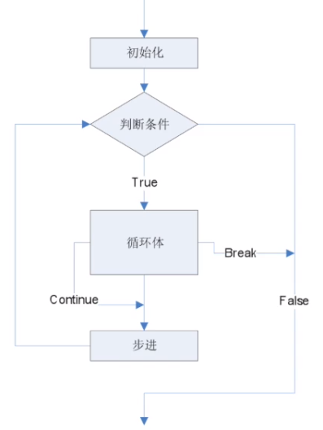

### break 与 continue
#### break 跳出这个循环
 \
e.g. 判断是否是素数
```c
#include <stdio.h>

int main() {
    int i = 997;
    int s =2;
    int isPrime =1;
    for (; s < i; s++) {
        if ( i % s == 0) {
            isPrime = 0;
            break;
        }
    }
    if (isPrime == 1) {
        printf("是素数\n");
    } else {
        printf("不是素数\n");
    }
    return 0;
}
```

#### continue 是放弃循环之后的语句